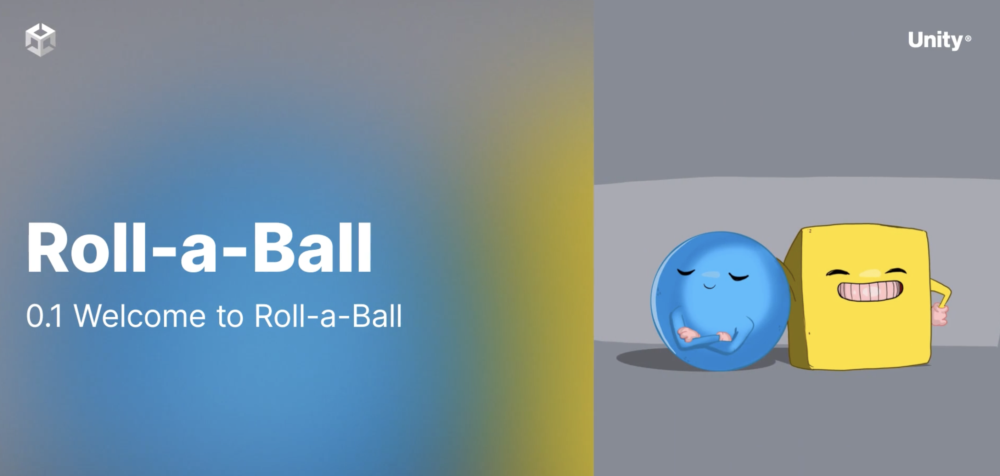

# Roll A Ball- Mini game developed in Unity

Summary: 
Welcome to Roll-a-ball! In this learning project, you’ll: Use Unity Editor and its built-in capabilities to set up a simple game environment Write your own custom scripts to create the game functionality Create a basic user interface to improve the game experience Build your game, so other people can play it!

Project Objective
- Understand how to Navigate the Editor 
- Create Scripts in C#
- Set up input using the new Input System.
- Create a Basic User Interface
